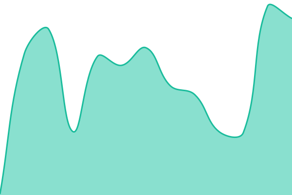
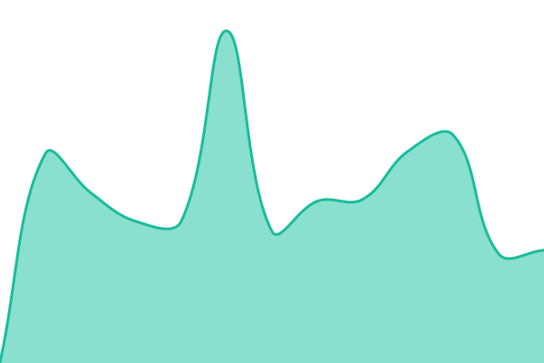

# [📈 Live Status](https://status.protoquiz.com): <!--live status--> **🟩 All systems operational**

This repository contains the open-source uptime monitor and status page for [jadenschwartz22-ops](https://status.protoquiz.com), powered by [Upptime](https://github.com/upptime/upptime).

With [Upptime](https://upptime.js.org), you can get your own unlimited and free uptime monitor and status page, powered entirely by a GitHub repository. We use [Issues](https://github.com/jadenschwartz22-ops/protoquiz-status/issues) as incident reports, [Actions](https://github.com/jadenschwartz22-ops/protoquiz-status/actions) as uptime monitors, and [Pages](https://status.protoquiz.com) for the status page.

<!--start: status pages-->
<!-- This summary is generated by Upptime (https://github.com/upptime/upptime) -->
<!-- Do not edit this manually, your changes will be overwritten -->
<!-- prettier-ignore -->
| URL | Status | History | Response Time | Uptime |
| --- | ------ | ------- | ------------- | ------ |
|  [ProtoQuiz Marketing Site](https://protoquiz.com) | 🟩 Up | [proto-quiz-marketing-site.yml](https://github.com/jadenschwartz22-ops/protoquiz-status/commits/HEAD/history/proto-quiz-marketing-site.yml) | 

 163ms
     
 | 

<a href="https://status.protoquiz.com/history/proto-quiz-marketing-site">100.00%</a>
    

|  [ProtoQuiz Agency Page](https://protoquiz.com/agency/) | 🟩 Up | [proto-quiz-agency-page.yml](https://github.com/jadenschwartz22-ops/protoquiz-status/commits/HEAD/history/proto-quiz-agency-page.yml) | 

 109ms
     
 | 

<a href="https://status.protoquiz.com/history/proto-quiz-agency-page">100.00%</a>
    

|  [ProtoQuiz Trust & Security](https://protoquiz.com/trust/) | 🟩 Up | [proto-quiz-trust-and-security.yml](https://github.com/jadenschwartz22-ops/protoquiz-status/commits/HEAD/history/proto-quiz-trust-and-security.yml) | 

 75ms
     
 | 

<a href="https://status.protoquiz.com/history/proto-quiz-trust-and-security">100.00%</a>
    

|  [ProtoQuiz B2B Terms](https://protoquiz.com/b2b/terms/) | 🟩 Up | [proto-quiz-b2-b-terms.yml](https://github.com/jadenschwartz22-ops/protoquiz-status/commits/HEAD/history/proto-quiz-b2-b-terms.yml) | 

 81ms
     
 | 

<a href="https://status.protoquiz.com/history/proto-quiz-b2-b-terms">100.00%</a>
    

|  [Backend API (api.protoquiz.com)](https://api.protoquiz.com/api/monitor?type=health) | 🟩 Up | [backend-api-api-protoquiz-com.yml](https://github.com/jadenschwartz22-ops/protoquiz-status/commits/HEAD/history/backend-api-api-protoquiz-com.yml) | 

 1639ms
     
 | 

<a href="https://status.protoquiz.com/history/backend-api-api-protoquiz-com">94.96%</a>
    

|  [B2B Platform (Highland reference)](https://highland.protoquiz.com) | 🟩 Up | [b2-b-platform-highland-reference.yml](https://github.com/jadenschwartz22-ops/protoquiz-status/commits/HEAD/history/b2-b-platform-highland-reference.yml) | 

 136ms
     
 | 

<a href="https://status.protoquiz.com/history/b2-b-platform-highland-reference">100.00%</a>
    

|  [B2B Platform (Demo)](https://southmetro.protoquiz.com) | 🟩 Up | [b2-b-platform-demo.yml](https://github.com/jadenschwartz22-ops/protoquiz-status/commits/HEAD/history/b2-b-platform-demo.yml) | 

 115ms
     
 | 

<a href="https://status.protoquiz.com/history/b2-b-platform-demo">100.00%</a>
    

<!--end: status pages-->

[**Visit our status website →**](https://status.protoquiz.com)

## 📄 License

- Powered by: [Upptime](https://github.com/upptime/upptime)
- Code: [MIT](./LICENSE) © [Anand Chowdhary](https://anandchowdhary.com), supported by [Pabio](https://pabio.com)
- Data in the `./history` directory: [Open Database License](https://opendatacommons.org/licenses/odbl/1-0/)
